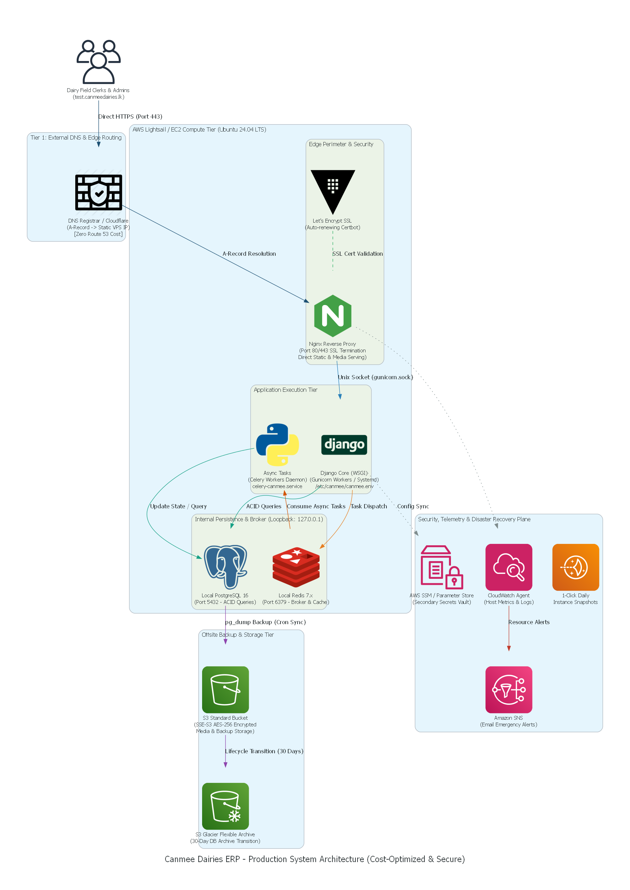

# Option 1: Ultra-Low Budget Architecture (AWS Lightsail)

**Cost-Optimized Blueprint (~$12.43/mo) for Micro-Tier Workloads**

---

## 1. Overview & Positioning

This architectural option provides an ultra-low-cost, predictable pricing model tailored for operational scenarios, pre-revenue business tools, or agricultural supply-chain workloads where cloud infrastructure spend must be strictly minimized.

By hosting the entire operational stack—compute, high-performance SSD persistence, static networking, and data egress—within a single AWS Lightsail 2GB bundle tier, the recurring platform infrastructure spend is stabilized at **~$12.43/month** while providing full systemd daemonization and root control that legacy shared hosting environments strictly prohibit.

---

## 2. Strategic Trade-offs (Lightsail vs. Dedicated VPC)

| Evaluation Factor          | Option 1: AWS Lightsail Budget      | Option 2: Dedicated EC2 VPC (Selected)                       |
| :------------------------- | :---------------------------------- | :----------------------------------------------------------- |
| **Monthly Baseline Cost**  | **~$12.43 / month**                 | **~$12.62 / month**                                          |
| **Public IPv4 Cost**       | **Included in bundle ($0.00)**      | Billed separately ($3.65/mo)                                 |
| **Compute Sizing**         | 1 vCPU, 2 GB RAM (Bundle: 2GB)      | 1 vCPU, 1–2 GB RAM (t4g.small ARM64 Graviton)                |
| **Storage Allocation**     | **40 GB NVMe SSD Included ($0.00)** | 20 GB gp3 EBS Volume ($1.60/mo)                              |
| **Outbound Data Transfer** | **1 TB Outbound / mo Included**     | Standard Data Egress / CloudFront Free Tier                  |
| **Network Architecture**   | Flat Cloud Firewall / Port Rules    | Multi-Tier Subnets, Private VPC (`10.0.0.0/16`), NACLs & SGs |
| **Scalability Horizon**    | Vertical upgrade via bundle resize  | Modular decoupled scale (Managed RDS, ElastiCache, ALB)      |
| **Compliance & Isolation** | Shared VPC boundary                 | True multi-tenant VPC isolation boundary                     |

---

## 3. High-Level Architecture Design



---

## 4. Cost Breakdown (Verified AWS Pricing Calculator Baseline)

By taking advantage of the bundled static IP and block storage, while eliminating Amazon Route 53 hosted zone recurring fees ($0.66/month saved) via external DNS management, the total monthly infrastructure expenditure is structured as follows:

| Component                      | Sizing & Configuration                                                                                        | Monthly Cost (USD)        |
| :----------------------------- | :------------------------------------------------------------------------------------------------------------ | :------------------------ |
| **Amazon Lightsail**           | **Bundle: 2GB** (1 vCPU, 2GB RAM, 40GB SSD, 1TB Transfer)<br>• Dedicated Static IPv4 Address: Bundled ($0.00) | **$11.77**                |
| **Amazon S3 Standard**         | 20 GB Storage, 20,000 PUT/COPY & 100,000 GET requests                                                         | **$0.66**                 |
| **Amazon S3 Glacier Flexible** | 2 GB Archive Storage, 100 Lifecycle transitions, 1 Restore/mo                                                 | **Included in $0.66**     |
| **Amazon Route 53**            | _Eliminated:_ Sub-domain A-record routed via Cloudflare / Registrar                                           | **$0.00** _(Saved $0.66)_ |
| **Amazon CloudFront**          | AWS Free Tier Plan (Global CDN & Edge Caching)                                                                | **$0.00**                 |
| **Amazon SNS**                 | TelemetryAlerts topic (10,000 requests, 1,000 email alerts)                                                   | **$0.00**                 |
| **AWS Systems Manager**        | Parameter Store (Standard parameters for encrypted secrets)                                                   | **$0.00**                 |
| **Total Monthly Spend**        | **Self-Contained Production Workload**                                                                        | **$12.43 / mo**           |

---

## 5. Deployment & Runtime Guidelines

### 5.1 Memory Safeguards (Swap Allocation)

Because the compute instance operates on 2 GB of physical memory, running PostgreSQL 16, Redis, Gunicorn, and Celery concurrently risks encountering Linux OOM (Out Of Memory) process termination. A mandatory **2 GB Swapfile** must be provisioned:

```bash
sudo fallocate -l 2G /swapfile
sudo chmod 600 /swapfile
sudo mkswap /swapfile
sudo swapon /swapfile
echo '/swapfile none swap sw 0 0' | sudo tee -a /etc/fstab
```

### 5.2 Network Firewall Configuration

Configure perimeter filtering through the AWS Lightsail networking panel:

- **Port 22 (SSH):** Open (Restricted to administrator management CIDRs recommended).
- **Port 80 (HTTP):** Open (Mandatory for Let's Encrypt challenge validation and 301 HTTPS redirection).
- **Port 443 (HTTPS):** Open (Encrypted application ingress).
- **Internal Ports (5432, 6379, 8000):** Strictly closed to external traffic and bound to `127.0.0.1`.

### 5.3 Service Supervision (systemd)

All application runtime daemons execute as localized systemd service units:

- `gunicorn-canmee.service`: WSGI application server pooling workers over local sockets.
- `redis-server.service`: In-memory broker bound to `127.0.0.1:6379`.
- `celery-canmee.service`: Task worker consuming background PDF generation and ledger processing jobs.

### 5.4 Automated Offsite Disaster Recovery

Nightly database state is archived offsite directly to Amazon S3 Standard with automated lifecycle policies:

```bash
# Automated nightly backup cron
pg_dump -U canmee_user -h 127.0.0.1 -Fc canmee_prod > /var/backups/postgres/canmee_$(date +%F).dump
aws s3 cp /var/backups/postgres/canmee_$(date +%F).dump s3://canmee-dairies-backups-ap-south-1/database/ --sse AES256
find /var/backups/postgres/ -type f -name "*.dump" -mtime +2 -delete
```

---

## 6. Target Workload Fit

- Small ERP, CRM, or billing instances handling 10–25 simultaneous active users.
- Agricultural collection centers logging daily milk intake transactions and batch records.
- Staging or customer-facing demonstration environments requiring continuous uptime.
- Scenarios requiring root daemon privileges and Redis/Celery task runners that cannot be deployed on traditional shared cPanel hosting.
